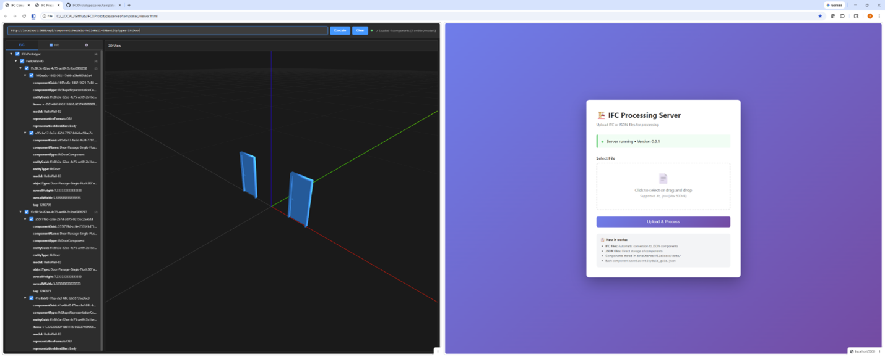
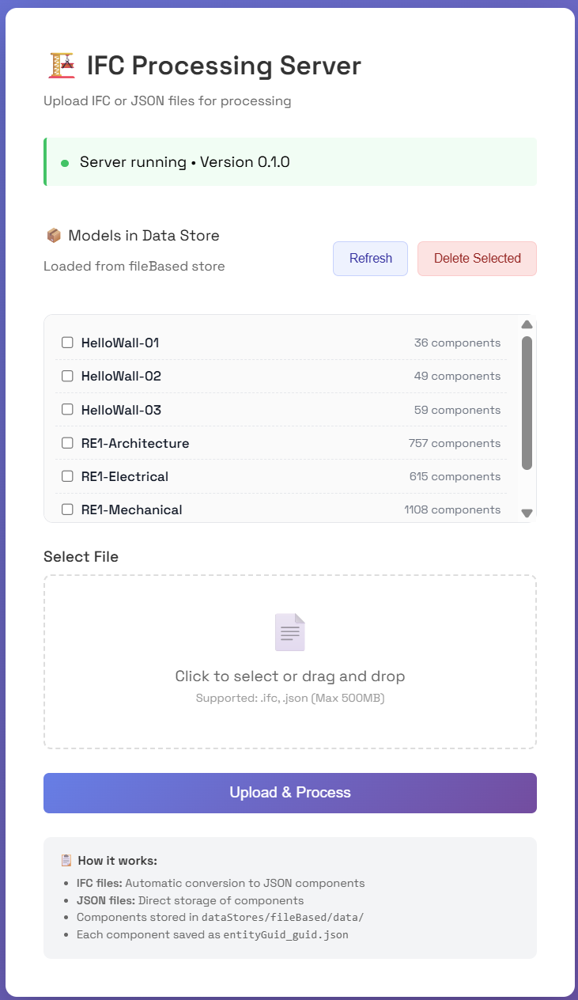
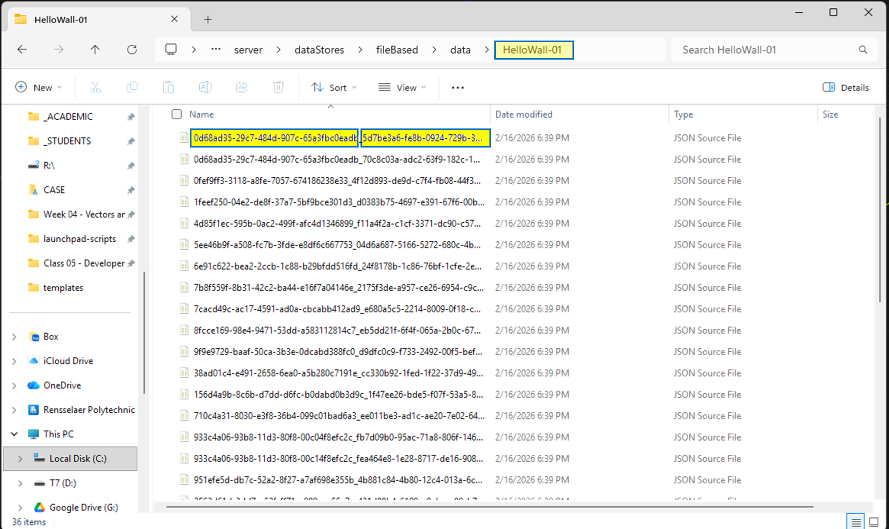
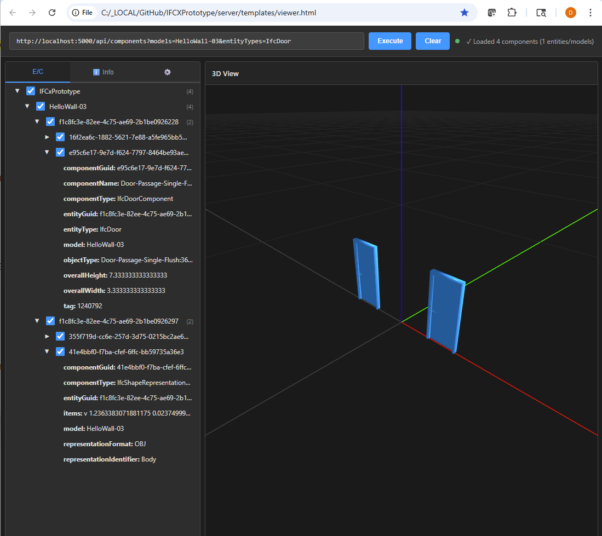
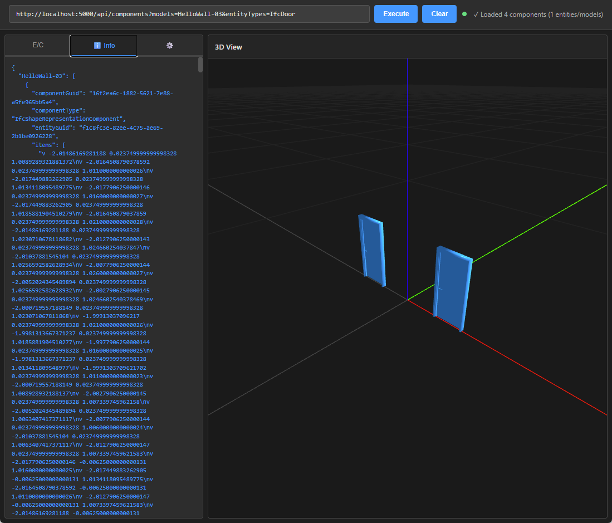

# IFCXPrototype
An ECS flavor of IFCX using simple IFC 4.X inspired components

## Live Demo

The full repo is https://github.com/Drshelden/IFCXPrototype.

A live version of the server is located on Heroku:
https://ifc-ecs-prototype-daa447b4d672.herokuapp.com/

Queries can be run against this instance, for example:
```
https://ifc-ecs-prototype-daa447b4d672.herokuapp.com/api/components?models=HelloWall-03
```


## Getting Started

Basic process is:
- Set up the environment (currently `.venv\Scripts\Activate.ps1` or possibly `activate` or `activate.bat`)
- Run `python server.py --backend fileBased`
- Upload some IFC models at http://localhost:5000/
- Open the viewer
- Type some queries in like `http://localhost:5000/api/components?models=HelloWall-03&entityTypes=IfcDoor`

## Overview

Parts of this development include:

1. **A basic data convention for entities and components** derived from IfcClasses. Currently implemented with IfcObjectDefinitions, IfcPropertySets, IfcRelations, and IfcShapeRepresentations and their subclasses. No reason it can't be extended to cover everything selectively.

2. **An IFC 2.3 - IFC 4.0 converter**, which generates IFCXJson based components from IFC files. Heavily based on IfcOpenShell.

3. **A component server**, which ingests IFC files, stores them in a local file store (so that eventually they can be git'ted), reads them into memory and provides API endpoints and query parameters (entityType=IfcDoor, etc.)

4. **A viewer** which allows users to issue these queries to servers, and see the results.

---

## 1. Component Data Format

Not yet in a schema and probably some of the assumptions should be debated. But essentially every relevant "First Class" IFC 4.x object (i.e., something with a GlobalId) becomes a component, with its own ComponentGuid that tries to consistently reference an EntityGuid. The entity Guid is generally the IFC ID from Revit or IFC 4.X, and each component takes on a new deterministically computed GUID of its own.

### Example: IfcObjectDefinition Component

Here's a typical component derived from an IfcObjectDefinition subclass:

```json
{
  "componentGuid": "5e12c068-af96-58f5-24fc-14a107018001",
  "componentName": "Door-Passage-Single-Flush:36\" x 84\":1200277",
  "componentType": "IfcDoorComponent",
  "entityGuid": "5d5ebb4e-ce31-4562-84ca-7319910fb518",
  "entityType": "IfcDoor",
  "objectType": "Door-Passage-Single-Flush:36\" x 84\"",
  "overallHeight": 7.333333333333333,
  "overallWidth": 3.333333333333333,
  "tag": "1200277"
}
```

This is an IfcObjectDefinitionComponent. It has all the attributes of the old IfcDoor class instance, plus:
- **componentGuid** - a new, deterministically determined (hashing component type & entityID) guid of this component
- **componentType** - every component says what type of component it is - typically expressed as IfcObjectTypeComponent. Using this right now instead of a URI. To be discussed
- **entityGuid** - points to THE Door by guid reference. This is the converted IFC ID instance parameter from Revit / IFC 4.X
- **entityType** - the IfcObject class name - are used to tell systems the type of the entity (this is "the only place" where this definition occurs. This info is uniquely carried in the component that contains the class attributes)
- The rest of the class attributes - in this case overallHeight, etc.

### Example: IfcRelation Component

Here's an IfcRelation component. These are very simple, since the references in the relation are first class objects (i.e., with a GlobalId in 4.x), they are passed by reference with their Guids:

```json
{
  "componentGuid": "fea464e8-1e28-8717-de16-90877aa591a2",
  "componentType": "IfcRelContainedInSpatialStructureComponent",
  "entityGuid": "933c4a06-93b8-11d3-80f8-00c14f8efc2c",
  "relatedElements": [
    "5d5ebb4e-ce31-4562-84ca-7319910fb5e3",
    "5d5ebb4e-ce31-4562-84ca-7319910fb518"
  ],
  "relatingStructure": "933c4a06-93b8-11d3-80f8-00c04f8efc2c"
}
```

### Example: IfcPropertySet Component

This component "points to its property set" via its old IFC ID, and a unique componentGuid for this component is created. Since properties do not have GlobalIds and therefore are not first class objects, these are passed by value - recursively read into the hasProperties field:

```json
{
  "componentGuid": "7a5d3a4d-2f5a-85b7-f6c9-c2533bbb1c5a",
  "componentName": "Pset_BuildingCommon",
  "componentType": "IfcPropertySetComponent",
  "entityGuid": "e3ba26fe-610c-1f96-a9fd-ec795a8571f3",
  "hasProperties": [
    {
      "name": "NumberOfStoreys",
      "nominalValue": {
        "type": "IfcIntegerComponent",
        "wrappedValue": 1
      },
      "type": "IfcPropertySingleValueComponent"
    },
    {
      "name": "IsLandmarked",
      "nominalValue": {
        "type": "IfcLogicalComponent",
        "wrappedValue": "UNKNOWN"
      },
      "type": "IfcPropertySingleValueComponent"
    }
  ]
}
```

### Example: IfcShapeRepresentation Component

Here's a ShapeRepresentationComponent (sorry, still in OBJ, haven't tried fbx yet). Precise metadata and formatting to be discussed:

```json
{
  "componentGuid": "fd5eaf75-98e8-f95b-0ad4-5e27e911da0c",
  "componentType": "IfcShapeRepresentationComponent",
  "entityGuid": "101695e4-f7c6-46b0-8f70-8a0172df5a17",
  "representationIdentifier": "Body",
  "representationFormat": "OBJ",
  "items": [
    "v 2.032 0.1016 0.0\nv 2.032 -0.1016 0.0\nv 2.032 ...f 2 1 4\nf 3 2 4\nf 3 4 6\nf 5 3 6\nf 5 6 8\nf 7 5 8\nf 7 8 1\nf 2 7 1\nf 4 1 6\nf 1 8 6\nf 5 2 3\nf 5 7 2\n"
  ]
}
```

---

## 2. IFC 2.3 - IFC 4.0 Converter

This was inspired by Jan Brouwer's IFCJSON converter. It uses IfcOpenShell to walk the IFC graph and then the above substitutions are made.

To run:
```bash
python ifc4ingestor.py inputFile.ifc -o outputFile.json
```

This translator is deployed on the server to process uploaded IFC files.

**Note**: Currently the assimilator only saves components for subclasses of IfcObjectDescription, IfcPropertySet, IfcRelation, and IfcShapeRepresentation only. The set of classes and parameters supported in this version is deliberately culled to remove many of the subsets of IFC objects:
- All geometries are stripped out and replaced with a triangulated IfcShapeRepresentation
- Miscellaneous classes like Actors, Scheduled etc. are not included yet (although the current importer should generally support them - needs more testing)
- Others are filtered out simply by not including them on import (in which case they are either imported by value or simply left pointing to the IFC Guid of the relevant entity)

---

## 3. Component Server



Does the following:

### Upload and Conversion
Allows users to upload `.ifc` files which are converted to components by the IFC 4.X converter (or uploaded in IFCXJson directly).

### Local Storage
Stores the components locally. Currently every component is written out to a folder with the name `entityGuid_componentGuid.json`, in the folder named by the file name of the uploaded `model.ifc` file. These file names become model names in the current implementation (to be discussed).



By storing this way we anticipate git-like interactions with this store. Note also that components associated with the same entity are grouped together alphabetically.

**Example**: Here's the component JSON file for `0d68ad35-29c7-484d-907c-65a3fbc0eadb_5d7be3a6-fe8b-0924-729b-33cd0f175b6a.json` in data/HelloWall-01:

```json
{
  "componentGuid": "5d7be3a6-fe8b-0924-729b-33cd0f175b6a",
  "componentName": "Basic Wall:Generic - 8\":1240542",
  "componentType": "IfcWallStandardCaseComponent",
  "entityGuid": "0d68ad35-29c7-484d-907c-65a3fbc0eadb",
  "entityType": "IfcWallStandardCase",
  "objectType": "Basic Wall:Generic - 8\"",
  "tag": "1240542"
}
```

Future data stores (such as GraphDB, MongoDB, etc.) are anticipated, but this file-based approach was attempted first to support git testing. I'm currently working on a modular approach where servers can be specified as having a file-based backend, MongoDB (next), and then maybe git-based.

### REST API Endpoints

Allows retrieval by REST endpoint queries. The set of REST endpoints is documented in [API_DOCUMENTATION](server/docs/API_DOCUMENTATION.md), [API_QUICK_REFERENCE](server/docs/API_QUICK_REFERENCE.md), and the [openapi.yaml](server/standards/openapi.yaml) file.

Endpoints include:
- `/api/upload`
- `/api/entityTypes`
- `/api/entityGuids`
- `/api/componentGuids`
- `/api/components` - returns the actual data of the selected component - specified by componentGuids or one or more of the filters below

**Filters**: Wherever appropriate, the following filters can be applied:
- `models=model_01,model_02`
- `entityTypes=IfcType1,IfcType2`
- `componentTypes=IfcType1Component,IfcType2Component`
- `entityGuids=guid1,guid2`
- `componentGuids=guid1,guid2`

Notably, for the `entityTypes` and `componentTypes` filters you can enter a base class like `IfcProduct` and it will find all the entities or components that are of this class or subclasses.

---

## 4. Viewer

Does the basics. There is a field for entering a full web REST call - currently at localhost:5000. Queries such as those listed in the quick reference can be made, such as:

```
http://localhost:5000/api/components?models=HelloWall-03&entityTypes=IfcDoor




```

There is also an "info" tab which shows exactly what's coming back from the server.

---



## Documentation

For more detailed information, see the documentation in the `server/docs/` folder:
- [Quick Start Guide](server/docs/QUICK_START.md)
- [API Documentation](server/docs/API_DOCUMENTATION.md)
- [API Quick Reference](server/docs/API_QUICK_REFERENCE.md)
- [Viewer Guide](server/docs/VIEWER_GUIDE.md)
